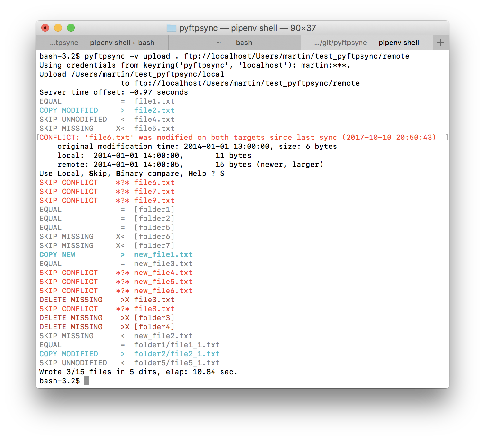

.. pyftpsync documentation master file, created by
   sphinx-quickstart on Sun May 24 20:50:55 2015.
   You can adapt this file completely to your liking, but it should at least
   contain the root `toctree` directive.

.. _main-index:

#######################
pyftpsync Documentation
#######################

*Synchronize local directories with FTP server.*

:Project:   https://github.com/mar10/pyftpsync/
:License:   `The MIT License <https://raw.github.com/mar10/pyftpsync/master/LICENSE>`_
:Author:    Martin Wendt
:Version:   |version|
:Date:      |today|

.. toctree::
   :hidden:

   self
   architecture
   modules

.. .. toctree::
..    :titlesonly:

..    architecture
..    modules

.. comment
   genindex
   modindex
   search
   :ref:`modindex`

|travis_badge| |nbsp| |pypi_badge| |nbsp| |dl_badge| |nbsp| |lic_badge| |nbsp| |rtd_badge|

Features
========

  * This is a command line tool...
  * ... and a library for use in your Python projects.
  * Upload, download, and bi-directional synch mode.
  * FTPS (TLS) support on Python 2.7/3.2+.
  * Allows FTP-to-FTP and Filesystem-to-Filesystem synchronization as well.
  * Architecture is open to add other target types.

Known limitations
-----------------

  * The FTP server must support the `MLST command <http://tools.ietf.org/html/rfc3659>`_.
  * pyftpsync uses file size and modification dates to detect file changes. 
    This is efficient, but not as robust as CRC checksums could be.
  * pyftpsync tries to detect conflicts (i.e. simultaneous modifications of 
    local and remote targets) by storing last sync time and size in a separate
    meta data file inside the local folders. This is not bullet proof and may
    fail under some conditions.

  In short: pyftpsync is not (nor tries to be a replacement for) a distributed 
  version control system. Make sure you have backups.

Quickstart
===========
.. comment
  See the `project page <https://github.com/mar10/pyftpsync/blob/master/CHANGES.md>`_
  for details.

.. todo::
   There will be a MSI installer available for Windows.

*Requirements:* `Python <http://www.python.org/download/ Python>`_ 2.6+ or 3 is required. 

Releases are hosted on `PyPI <https://pypi.python.org/pypi/pyftpsync>`_ and can 
be installed using `pip <http://www.pip-installer.org/>`_ or
`EasyInstall <http://pypi.python.org/pypi/setuptools#using-setuptools-and-easyinstall>`_::

  $ pip install -U pyftpsync

After that the ``pyftpsync`` command is available::

  $ pyftpsync --version
  1.0.3

and the ``ftpsync`` package can be used in Python code::

  $ python
  >>> from ftpsync import __version__
  >>> __version__
  '1.0.3'

Command line syntax
===================

Use the ``--help`` or ``-h`` argument to get help::

    $ pyftpsync -h
    usage: pyftpsync [-h] [--verbose | --quiet] [--version] [--progress]
                     {upload,download,sync} ...
    
    Synchronize folders over FTP.
    
    positional arguments:
      {upload,download,sync}
                            sub-command help
        upload              copy new and modified files to remote folder
        download            copy new and modified files from remote folder to
                            local target
        sync                synchronize new and modified files between remote
                            folder and local target
    
    optional arguments:
      -h, --help            show this help message and exit
      --verbose, -v         increment verbosity by one (default: 3, range: 0..5)
      --quiet, -q           decrement verbosity by one
      --version             show program's version number and exit
      --progress, -p        show progress info, even if redirected or verbose < 3
   $ 

Upload files syntax
-------------------

Command specific help is available like so::

    $ pyftpsync upload --help
    usage: pyftpsync upload [-h] [-x] [-f INCLUDE_FILES] [-o OMIT]
                            [--store-password] [--no-prompt] [--no-color]
                            [--force] [--resolve {local,skip,ask}] [--delete]
                            [--delete-unmatched]
                            LOCAL REMOTE
    
    positional arguments:
      LOCAL                 path to local folder (default: .)
      REMOTE                path to remote folder
    
    optional arguments:
      -h, --help            show this help message and exit
      -x, --execute         turn off the dry-run mode (which is ON by default),
                            that would just print status messages but does not
                            change anything
      -f INCLUDE_FILES, --include-files INCLUDE_FILES
                            wildcard for file names (default: all, separate
                            multiple values with ',')
      -o OMIT, --omit OMIT  wildcard of files and directories to exclude (applied
                            after --include)
      --store-password      save password to keyring if login succeeds
      --no-prompt           prevent prompting for missing credentials
      --no-color            prevent use of ansi terminal color codes
      --force               overwrite remote files, even if the target is newer
                            (but no conflict was detected)
      --resolve {local,skip,ask}
                            conflict resolving strategy (default: 'skip')
      --delete              remove remote files if they don't exist locally
      --delete-unmatched    remove remote files if they don't exist locally or
                            don't match the current filter (implies '--delete'
                            option)
   $

Example: Upload files
---------------------

Upload all new and modified files from user's temp folder to an FTP server. 
No files are changed on the local directory::

  $ pyftpsync upload ~/temp ftps://example.com/target/folder

Add the ``--delete`` option to remove all files from the remote target that 
don't exist locally::

  $ pyftpsync upload ~/temp ftps://example.com/target/folder --delete

Add the ``-x`` option to switch from DRY-RUN mode to real execution::

  $ pyftpsync upload ~/temp ftps://example.com/target/folder --delete -x

Replace ``ftps://`` with ``ftp://`` to disable TLS encryption.

Synchronize files syntax
------------------------
::

    $ pyftpsync sync --help
    usage: pyftpsync sync [-h] [-x] [-f INCLUDE_FILES] [-o OMIT]
                          [--store-password] [--no-prompt] [--no-color]
                          [--resolve {old,new,local,remote,skip,ask}]
                          LOCAL REMOTE
    
    positional arguments:
      LOCAL                 path to local folder (default: .)
      REMOTE                path to remote folder
    
    optional arguments:
      -h, --help            show this help message and exit
      -x, --execute         turn off the dry-run mode (which is ON by default),
                            that would just print status messages but does not
                            change anything
      -f INCLUDE_FILES, --include-files INCLUDE_FILES
                            wildcard for file names (default: all, separate
                            multiple values with ',')
      -o OMIT, --omit OMIT  wildcard of files and directories to exclude (applied
                            after --include)
      --store-password      save password to keyring if login succeeds
      --no-prompt           prevent prompting for missing credentials
      --no-color            prevent use of ansi terminal color codes
      --resolve {old,new,local,remote,skip,ask}
                            conflict resolving strategy (default: 'ask')
    $

Example: Synchronize folders
----------------------------

Two-way synchronization of a local folder with an FTP server::

  $ pyftpsync sync --store-password --resolve=ask --execute ~/temp ftps://example.com/target/folder

Script examples
===============

Upload changes from local folder to FTP server::

  from ftpsync.targets import FsTarget, UploadSynchronizer
  from ftpsync.ftp_target import FtpTarget

  local = FsTarget("~/temp")
  user ="joe"
  passwd = "secret"
  remote = FtpTarget("/temp", "example.com", user, passwd, tls=True)
  opts = {"force": False, "delete_unmatched": True, "verbose": 3, "dry_run" : False}
  s = UploadSynchronizer(local, remote, opts)
  s.run()

Synchronize local folder with FTP server::

  from ftpsync.targets import FsTarget, BiDirSynchronizer
  from ftpsync.ftp_target import FtpTarget

  local = FsTarget("~/temp")
  user ="joe"
  passwd = "secret"
  remote = FtpTarget("/temp", "example.com", user, passwd, tls=True)
  opts = {"resolve": "skip", "verbose": 1, "dry_run" : False}
  s = BiDirSynchronizer(local, remote, opts)
  s.run()

.. comment
  FAQ
  ===
    * ...

Contribute
==========
If you plan to debug or contribute, install to run directly from the source::

  $ python setup.py develop
  $ python setup.py test

The use of `virtualenv <https://virtualenv.pypa.io/en/latest/>`_ is recommended.

Indices and tables
==================

* :ref:`genindex`
* :ref:`modindex`
* :ref:`search`

.. |travis_badge| image:: https://travis-ci.org/mar10/pyftpsync.png?branch=master
   :alt: Build Status
   :target: https://travis-ci.org/mar10/pyftpsync

.. |pypi_badge| image:: https://img.shields.io/pypi/v/pyftpsync.svg
   :alt: PyPI Version
   :target: https://pypi.python.org/pypi/pyftpsync/

.. |dl_badge| image:: https://img.shields.io/pypi/dm/pyftpsync.svg
   :alt: Downloads
   :target: https://pypi.python.org/pypi/pyftpsync/

.. |lic_badge| image:: https://img.shields.io/pypi/l/pyftpsync.svg
   :alt: License
   :target: https://pypi.python.org/pypi/pyftpsync/

.. |rtd_badge| image:: https://readthedocs.org/projects/pyftpsync/badge/?version=latest
   :target: http://pyftpsync.readthedocs.org/en/latest/
   :alt: Documentation Status

.. |nbsp| unicode:: 0xA0 
   :trim:
